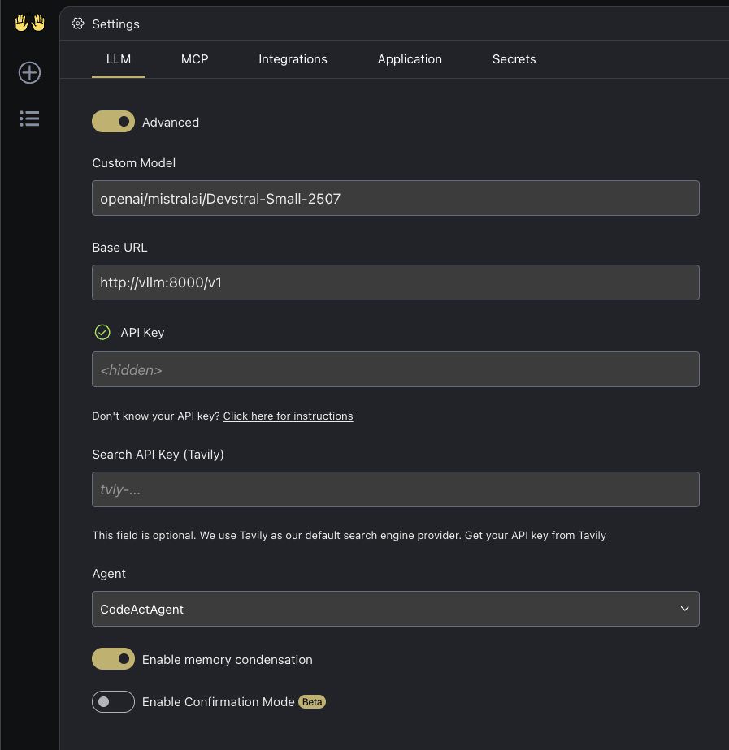
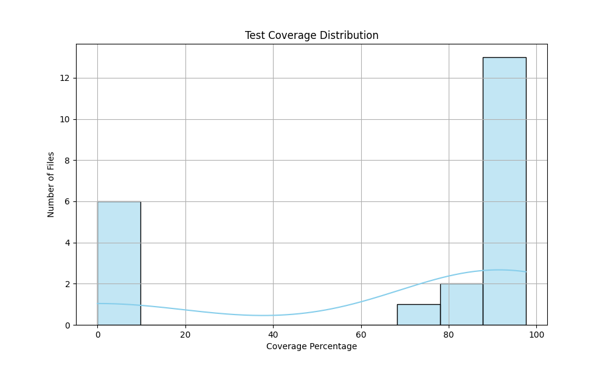
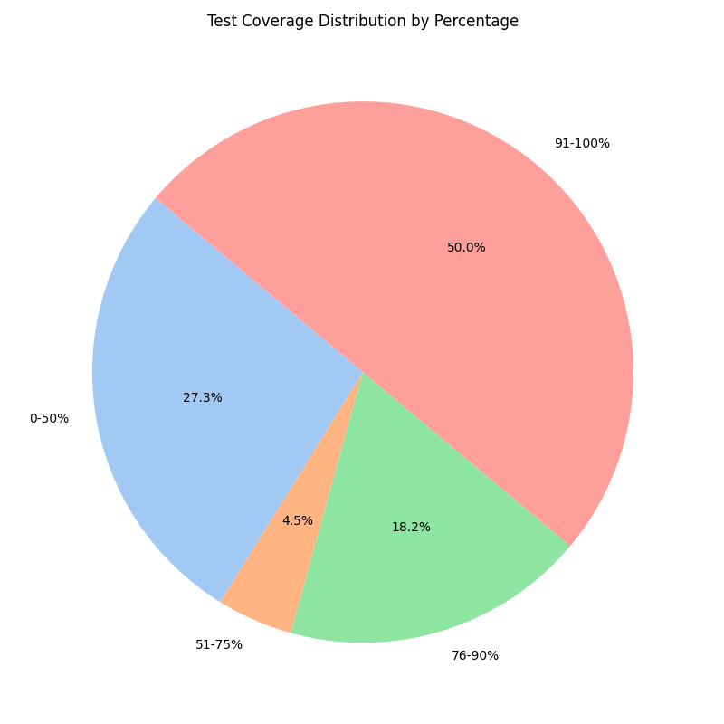
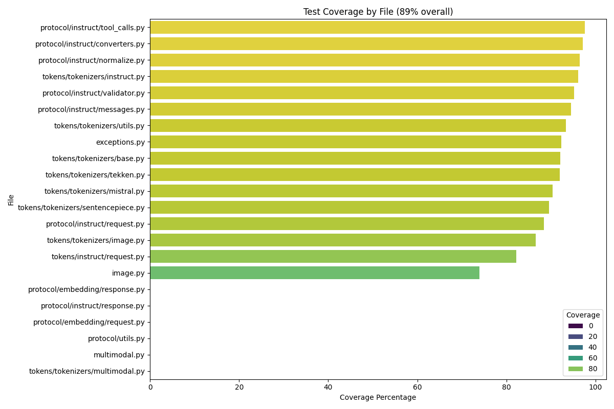
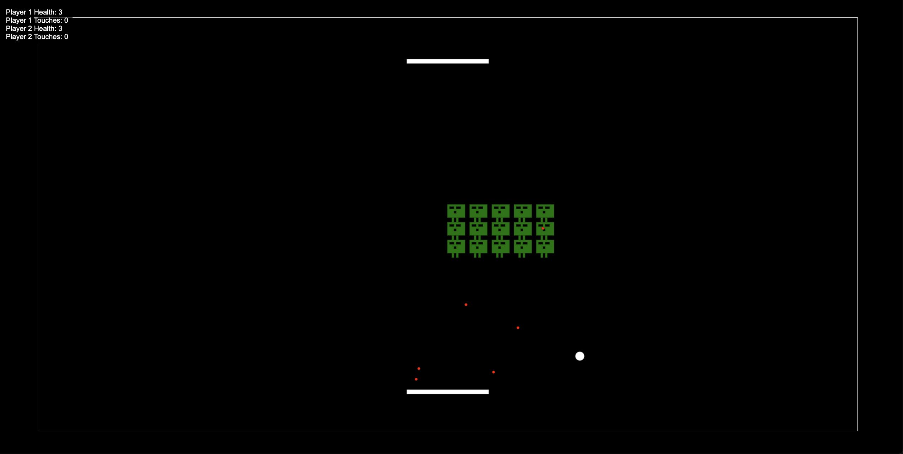

---
language:
- en
- fr
- de
- es
- pt
- it
- ja
- ko
- ru
- zh
- ar
- fa
- id
- ms
- ne
- pl
- ro
- sr
- sv
- tr
- uk
- vi
- hi
- bn
license: apache-2.0
library_name: vllm
inference: false
base_model:
- mistralai/Mistral-Small-3.1-24B-Instruct-2503
extra_gated_description: >-
  If you want to learn more about how we process your personal data, please read
  our <a href="https://mistral.ai/terms/">Privacy Policy</a>.
pipeline_tag: text2text-generation
---

# Devstral Small 1.1

Devstral is an agentic LLM for software engineering tasks built under a collaboration between [Mistral AI](https://mistral.ai/) and [All Hands AI](https://www.all-hands.dev/) 🙌. Devstral excels at using tools to explore codebases, editing multiple files and power software engineering agents. The model achieves remarkable performance on SWE-bench which positionates it as the #1 open source model on this [benchmark](#benchmark-results). 

It is finetuned from [Mistral-Small-3.1](https://huggingface.co/mistralai/Mistral-Small-3.1-24B-Base-2503), therefore it has a long context window of up to 128k tokens. As a coding agent, Devstral is text-only and before fine-tuning from `Mistral-Small-3.1` the vision encoder was removed.

For enterprises requiring specialized capabilities (increased context, domain-specific knowledge, etc.), we will release commercial models beyond what Mistral AI contributes to the community.

Learn more about Devstral in our [blog post](https://mistral.ai/news/devstral-2507).

**Updates compared to [`Devstral Small 1.0`](https://huggingface.co/mistralai/Devstral-Small-2505):**
- Improved performance, please refer to the [benchmark results](#benchmark-results).
- `Devstral Small 1.1` is still great when paired with OpenHands. This new version also generalizes better to other prompts and coding environments. 
- Supports [Mistral's function calling format](https://mistralai.github.io/mistral-common/usage/tools/).


## Key Features:
- **Agentic coding**: Devstral is designed to excel at agentic coding tasks, making it a great choice for software engineering agents.
- **lightweight**: with its compact size of just 24 billion parameters, Devstral is light enough to run on a single RTX 4090 or a Mac with 32GB RAM, making it an appropriate model for local deployment and on-device use.
- **Apache 2.0 License**: Open license allowing usage and modification for both commercial and non-commercial purposes.
- **Context Window**: A 128k context window.
- **Tokenizer**: Utilizes a Tekken tokenizer with a 131k vocabulary size.


## Benchmark Results

### SWE-Bench

Devstral Small 1.1 achieves a score of **53.6%** on SWE-Bench Verified, outperforming Devstral Small 1.0 by +6,8% and the second best state of the art model by +11.4%.

| Model              | Agentic Scaffold   | SWE-Bench Verified (%) |
|--------------------|--------------------|------------------------|
| Devstral Small 1.1 | OpenHands Scaffold | **53.6**               |
| Devstral Small 1.0 | OpenHands Scaffold | *46.8*                 |
| GPT-4.1-mini       | OpenAI Scaffold    | 23.6                   |
| Claude 3.5 Haiku   | Anthropic Scaffold | 40.6                   |
| SWE-smith-LM 32B   | SWE-agent Scaffold | 40.2                   |
| Skywork SWE        | OpenHands Scaffold | 38.0                   |
| DeepSWE            | R2E-Gym   Scaffold | 42.2                   |


 When evaluated under the same test scaffold (OpenHands, provided by All Hands AI 🙌), Devstral exceeds far larger models such as Deepseek-V3-0324 and Qwen3 232B-A22B.


## Usage

We recommend to use Devstral with the [OpenHands](https://github.com/All-Hands-AI/OpenHands/tree/main) scaffold.
You can use it either through our API or by running locally.

### API 
Follow these [instructions](https://docs.mistral.ai/getting-started/quickstart/#account-setup) to create a Mistral account and get an API key.

Then run these commands to start the OpenHands docker container.
```bash
export MISTRAL_API_KEY=<MY_KEY>

mkdir -p ~/.openhands && echo '{"language":"en","agent":"CodeActAgent","max_iterations":null,"security_analyzer":null,"confirmation_mode":false,"llm_model":"mistral/devstral-small-2507","llm_api_key":"'$MISTRAL_API_KEY'","remote_runtime_resource_factor":null,"github_token":null,"enable_default_condenser":true}' > ~/.openhands-state/settings.json

docker pull docker.all-hands.dev/all-hands-ai/runtime:0.48-nikolaik

docker run -it --rm --pull=always \
    -e SANDBOX_RUNTIME_CONTAINER_IMAGE=docker.all-hands.dev/all-hands-ai/runtime:0.48-nikolaik \
    -e LOG_ALL_EVENTS=true \
    -v /var/run/docker.sock:/var/run/docker.sock \
    -v ~/.openhands:/.openhands \
    -p 3000:3000 \
    --add-host host.docker.internal:host-gateway \
    --name openhands-app \
    docker.all-hands.dev/all-hands-ai/openhands:0.48
```

### Local inference 

The model can also be deployed with the following libraries:
- [`vllm (recommended)`](https://github.com/vllm-project/vllm): See [here](#vllm-recommended)
- [`mistral-inference`](https://github.com/mistralai/mistral-inference): See [here](#mistral-inference)
- [`transformers`](https://github.com/huggingface/transformers): See [here](#transformers)
- [`LMStudio`](https://lmstudio.ai/): See [here](#lmstudio)
- [`llama.cpp`](https://github.com/ggml-org/llama.cpp): See [here](#llama.cpp)
- [`ollama`](https://github.com/ollama/ollama): See [here](#ollama)


#### vLLM (recommended)

<details>
<summary>Expand</summary

We recommend using this model with the [vLLM library](https://github.com/vllm-project/vllm)
to implement production-ready inference pipelines.

**_Installation_**

Make sure you install [`vLLM >= 0.9.1`](https://github.com/vllm-project/vllm/releases/tag/v0.9.1):

```
pip install vllm --upgrade
```

Also make sure to have installed [`mistral_common >= 1.7.0`](https://github.com/mistralai/mistral-common/releases/tag/v1.7.0).

```
pip install mistral-common --upgrade
```

To check:
```
python -c "import mistral_common; print(mistral_common.__version__)"
```

You can also make use of a ready-to-go [docker image](https://github.com/vllm-project/vllm/blob/main/Dockerfile) or on the [docker hub](https://hub.docker.com/layers/vllm/vllm-openai/latest/images/sha256-de9032a92ffea7b5c007dad80b38fd44aac11eddc31c435f8e52f3b7404bbf39).

**_Launch server_**

We recommand that you use Devstral in a server/client setting. 

1. Spin up a server:

```
vllm serve mistralai/Devstral-Small-2507 --tokenizer_mode mistral --config_format mistral --load_format mistral --tool-call-parser mistral --enable-auto-tool-choice --tensor-parallel-size 2
```


2. To ping the client you can use a simple Python snippet.

```py
import requests
import json
from huggingface_hub import hf_hub_download


url = "http://<your-server-url>:8000/v1/chat/completions"
headers = {"Content-Type": "application/json", "Authorization": "Bearer token"}

model = "mistralai/Devstral-Small-2507"

def load_system_prompt(repo_id: str, filename: str) -> str:
    file_path = hf_hub_download(repo_id=repo_id, filename=filename)
    with open(file_path, "r") as file:
        system_prompt = file.read()
    return system_prompt

SYSTEM_PROMPT = load_system_prompt(model, "SYSTEM_PROMPT.txt")

messages = [
    {"role": "system", "content": SYSTEM_PROMPT},
    {
        "role": "user",
        "content": [
            {
                "type": "text",
                "text": "<your-command>",
            },
        ],
    },
]

data = {"model": model, "messages": messages, "temperature": 0.15}

# Devstral Small 1.1 supports tool calling. If you want to use tools, follow this:
# tools = [ # Define tools for vLLM
#     {
#         "type": "function",
#         "function": {
#             "name": "git_clone",
#             "description": "Clone a git repository",
#             "parameters": {
#                 "type": "object",
#                 "properties": {
#                     "url": {
#                         "type": "string",
#                         "description": "The url of the git repository",
#                     },
#                 },
#                 "required": ["url"],
#             },
#         },
#     }
# ] 
# data = {"model": model, "messages": messages, "temperature": 0.15, "tools": tools} # Pass tools to payload.

response = requests.post(url, headers=headers, data=json.dumps(data))
print(response.json()["choices"][0]["message"]["content"])
```
</details>


#### Mistral-inference

<details>
<summary>Expand</summary

We recommend using mistral-inference to quickly try out / "vibe-check" Devstral.

**_Installation_**

Make sure to have mistral_inference >= 1.6.0 installed.

```bash
pip install mistral_inference --upgrade
```

**_Download_**

```python
from huggingface_hub import snapshot_download
from pathlib import Path

mistral_models_path = Path.home().joinpath('mistral_models', 'Devstral')
mistral_models_path.mkdir(parents=True, exist_ok=True)

snapshot_download(repo_id="mistralai/Devstral-Small-2507", allow_patterns=["params.json", "consolidated.safetensors", "tekken.json"], local_dir=mistral_models_path)
```

**_Chat_**

You can run the model using the following command:

```bash
mistral-chat $HOME/mistral_models/Devstral --instruct --max_tokens 300
```

You can then prompt it with anything you'd like.

</details>


#### Transformers

<details>
<summary>Expand</summary

To make the best use of our model with transformers make sure to have [installed](https://github.com/mistralai/mistral-common) `mistral-common >= 1.7.0` to use our tokenizer.

```bash
pip install mistral-common --upgrade
```

Then load our tokenizer along with the model and generate:

```python
import torch

from mistral_common.protocol.instruct.messages import (
    SystemMessage, UserMessage
)
from mistral_common.protocol.instruct.request import ChatCompletionRequest
from mistral_common.tokens.tokenizers.mistral import MistralTokenizer
from huggingface_hub import hf_hub_download
from transformers import AutoModelForCausalLM

def load_system_prompt(repo_id: str, filename: str) -> str:
    file_path = hf_hub_download(repo_id=repo_id, filename=filename)
    with open(file_path, "r") as file:
        system_prompt = file.read()
    return system_prompt

model_id = "mistralai/Devstral-Small-2507"
SYSTEM_PROMPT = load_system_prompt(model_id, "SYSTEM_PROMPT.txt")


tokenizer = MistralTokenizer.from_hf_hub(model_id)
model = AutoModelForCausalLM.from_pretrained(model_id)

tokenized = tokenizer.encode_chat_completion(
    ChatCompletionRequest(
        messages=[
            SystemMessage(content=SYSTEM_PROMPT),
            UserMessage(content="<your-command>"),
        ],
    )
)

output = model.generate(
    input_ids=torch.tensor([tokenized.tokens]),
    max_new_tokens=1000,
)[0]

decoded_output = tokenizer.decode(output[len(tokenized.tokens):])
print(decoded_output)
```

</details>


#### LM Studio

<details>
<summary>Expand</summary

Download the weights from either:
- LM Studio GGUF repository (recommended): https://huggingface.co/lmstudio-community/Devstral-Small-2507-GGUF
- our GGUF repository: https://huggingface.co/mistralai/Devstral-Small-2507_gguf

```
pip install -U "huggingface_hub[cli]"
huggingface-cli download \
"lmstudio-community/Devstral-Small-2507-GGUF" \ # or mistralai/Devstral-Small-2507_gguf
--include "Devstral-Small-2507-Q4_K_M.gguf" \
--local-dir "Devstral-Small-2507_gguf/"
```

You can serve the model locally with [LMStudio](https://lmstudio.ai/).
* Download [LM Studio](https://lmstudio.ai/) and install it
* Install `lms cli ~/.lmstudio/bin/lms bootstrap`
* In a bash terminal, run `lms import Devstral-Small-2507-Q4_K_M.gguf` in the directory where you've downloaded the model checkpoint (e.g. `Devstral-Small-2507_gguf`)
* Open the LM Studio application, click the terminal icon to get into the developer tab. Click select a model to load and select `Devstral Small 2507`. Toggle the status button to start the model, in setting toggle Serve on Local Network to be on.
* On the right tab, you will see an API identifier which should be `devstral-small-2507` and an api address under API Usage. Keep note of this address, this is used for OpenHands or Cline.

</details>


#### llama.cpp

<details>
<summary>Expand</summary

Download the weights from huggingface:

```
pip install -U "huggingface_hub[cli]"
huggingface-cli download \
"mistralai/Devstral-Small-2507_gguf" \
--include "Devstral-Small-2507-Q4_K_M.gguf" \
--local-dir "mistralai/Devstral-Small-2507_gguf/"
```

Then run Devstral using the llama.cpp server.

```bash
./llama-server -m mistralai/Devstral-Small-2507_gguf/Devstral-Small-2507-Q4_K_M.gguf -c 0 # -c configure the context size, 0 means model's default, here 128k.
```

</details>


### OpenHands (recommended)

#### Launch a server to deploy Devstral Small 1.1

Make sure you launched an OpenAI-compatible server such as vLLM or Ollama as described above. Then, you can use OpenHands to interact with `Devstral Small 1.1`.

In the case of the tutorial we spineed up a vLLM server running the command:
```bash
vllm serve mistralai/Devstral-Small-2507 --tokenizer_mode mistral --config_format mistral --load_format mistral --tool-call-parser mistral --enable-auto-tool-choice --tensor-parallel-size 2
```

The server address should be in the following format: `http://<your-server-url>:8000/v1`

#### Launch OpenHands

You can follow installation of OpenHands [here](https://docs.all-hands.dev/modules/usage/installation).

The easiest way to launch OpenHands is to use the Docker image:
```bash
docker pull docker.all-hands.dev/all-hands-ai/runtime:0.48-nikolaik

docker run -it --rm --pull=always \
    -e SANDBOX_RUNTIME_CONTAINER_IMAGE=docker.all-hands.dev/all-hands-ai/runtime:0.48-nikolaik \
    -e LOG_ALL_EVENTS=true \
    -v /var/run/docker.sock:/var/run/docker.sock \
    -v ~/.openhands:/.openhands \
    -p 3000:3000 \
    --add-host host.docker.internal:host-gateway \
    --name openhands-app \
    docker.all-hands.dev/all-hands-ai/openhands:0.48
```

Then, you can access the OpenHands UI at `http://localhost:3000`.

#### Connect to the server

When accessing the OpenHands UI, you will be prompted to connect to a server. You can use the advanced mode to connect to the server you launched earlier.

Fill the following fields:
- **Custom Model**: `openai/mistralai/Devstral-Small-2507`
- **Base URL**: `http://<your-server-url>:8000/v1`
- **API Key**: `token` (or any other token you used to launch the server if any)

<details>
<summary>See settings</summary>
                 


</details>


### Cline

#### Launch a server to deploy Devstral Small 1.1

Make sure you launched an OpenAI-compatible server such as vLLM or Ollama as described above. Then, you can use OpenHands to interact with `Devstral Small 1.1`.

In the case of the tutorial we spineed up a vLLM server running the command:
```bash
vllm serve mistralai/Devstral-Small-2507 --tokenizer_mode mistral --config_format mistral --load_format mistral --tool-call-parser mistral --enable-auto-tool-choice --tensor-parallel-size 2
```

The server address should be in the following format: `http://<your-server-url>:8000/v1`

#### Launch Cline

You can follow installation of Cline [here](https://docs.cline.bot/getting-started/installing-cline). Then you can configure the server address in the settings.

<details>
<summary>See settings</summary>
                  


</details>


### Examples

#### OpenHands:Understanding Test Coverage of Mistral Common

We can start the OpenHands scaffold and link it to a repo to analyze test coverage and identify badly covered files.
Here we start with our public `mistral-common` repo.


After the repo is mounted in the workspace, we give the following instruction
```
Check the test coverage of the repo and then create a visualization of test coverage. Try plotting a few different types of graphs and save them to a png.
```
The agent will first browse the code base to check test configuration and structure.


Then it sets up the testing dependencies and launches the coverage test:


Finally, the agent writes necessary code to visualize the coverage, export the results and save the plots to a png.


At the end of the run, the following plots are produced:




and the model is able to explain the results:


#### Cline: build a video game

First initialize Cline inside VSCode and connect it to the server you launched earlier.

We give the following instruction to builde the video game:
```
Create a video game that mixes Space Invaders and Pong for the web.

Follow these instructions:
- There are two players one at the top and one at the bottom. The players are controling a bar to bounce a ball.
- The first player plays with the keys "a" and "d", the second with the right and left arrows.
- The invaders are located at the center of the screen. They shoud look like the ones in Space Invaders. Their goal is to shoot on the players randomly. They cannot be destroyed by the ball that pass through them. This means that invaders never die.
- The players goal is to avoid shootings from the space invaders and send the ball to the edge of the over player.
- The ball bounces on the left and right edges.
- Once the ball touch one of the player's edge, the player loses.
- Once a player is touched 3 times or more by a shooting, the player loses.
- The player winning is the last one standing.
- Display on the UI, the number of times a player touched the ball, and the remaining health.
```


The agent will first create the game:


Then it will explain how to launch the game:


Finally, the game is ready to be played:



Don't hesitate to iterate or give more information to Devstral to improve the game!
